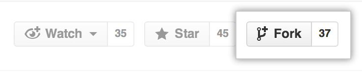

Developing and contribnuting to BrainVisa projects using git

General workflow
----------------

Many components of BrainVISA now have their source managed with Git, and are hosted on Github. If you are new to Git, you should read the short [GitHub Git handbook](https://guides.github.com/introduction/git-handbook/). You can find more information in the [Git and GitHub learning resources](https://help.github.com/articles/git-and-github-learning-resources/).

BrainVISA projects are managed by [brainvisa-cmake](http://brainvisa.info/brainvisa-cmake/index.html), a tool to manage the whole development process, including sources management, configuration and build, tests, and more. The main tool of `brainvisa-cmake` is [bv_maker](http://brainvisa.info/brainvisa-cmake/bv_maker.html).

For sources management, `bv_maker` relies on standard source versioning control software, namely `subversion` or `git`. It mainly adds a multi-project management layer.

### Setup a build environment

This can be done either using [casa-distro](http://brainvisa.info/casa-distro/index.html) which provides build environments in virtual containers, or on a host system, after installing all needed development libraries (list not provided here...), using [brainvisa-cmake](http://brainvisa.info/brainvisa-cmake/index.html).

* with casa-distro (simpler, recommended)
  * install [Singularity 3](https://sylabs.io/singularity/). Some Linux packages are available on [BrainVisa download page](https://new.brainvisa.info/download.html#using-singularity)
  * Alternative 1:
    * get a [developer image of BrainVisa/Casa-Distro](https://new.brainvisa.info/download.html#developers) (images named "casa-dev-\<system\>.sif" for Singularity)
    * follow the instructions on this page to setup a developer *environment* from the image
  * Alternative 2:
    * get [casa-distro](http://brainvisa.info/casa-distro/index.html)
    * create a [developer environment](https://brainvisa.github.io/casa-distro/concepts.html#environment), for instance:
          
          casa_distro setup_dev distro=opensource system=ubuntu-18.04 branch=master
  * edit appropriate configs in ``<env_dir>/conf``(especially ``svn.secret`` and ``bv_maker.cfg``) if needed
  * set the `bin` subdirectory of the *environment* directory in your `PATH` environment variable (can be done in a `.bash_profile` or `.bashrc` init file)
  * build using ``bv_maker``
  
  Some help about configuration is available on the [BrainVisa website](https://new.brainvisa.info/download.htmlconfiguration.html)

* on host system (more difficult)
  * Get [brainvisa-cmake](http://brainvisa.info/brainvisa-cmake/index.html)
  * [configure sources](http://brainvisa.info/brainvisa-cmake/compile_existing.html#edit-bv-maker-configuration-file)
  * install all needed thirdparty libraries dependencies (may be fastidious)
  * build using ``bv_maker``

### Read-only update access

While not developing, updating the codes is just a matter of using:
    
    bv_maker sources

see [bv_maker sources](#bv_maker_sources).
Or to update the code and rebuild the needed modifications, simply:

    bv_maker
    
either on the host system (for a host build) or in ``casa-distro``.

### Modifying / developing

When starting to develop into a project managed by ``git``, there are two possible modes: either *fork* the project on GitHub, or create a feature branch on the *origin* repository (if appropriate access rights are granted).

#### Several use cases

* fix a bug (light, needs to be quickly fixed) vs develop a new feature (heavier change, developing it may take a while)
* the user may or may not have push permission on the `origin` repository to create or modify a feature branch
* the user may or may not have push permission on the `origin` repository to push on the `master` branch. Normally only admins have such permission.

|                      | fix a bug | develop a feature |
| -------------------- | --------- | ----------------- |
| user has push access to `origin/master` | may push to master or [feature branch](#feature_branch) | [feature branch](#feature_branch) [with](#forking) or [without fork](#origin_branch) |
| user has push access to `origin/<feature>` | push to [feature branch](#feature_branch) [with](#forking) or [without fork](#origin_branch) | [feature branch](#feature_branch) [with](#forking) or [without fork](#origin_branch) |
| no push access       | [feature branch with fork](#forking) | [feature branch with fork](#forking) |

Basically we handle multiple projects the same way as working in a single project, we just need to perform commit / push / pull request operations multiple times. But we just needed tools to help automate at least update operations in multiple projects.

<a name="bv_maker_sources">

what bv_maker sources does / should do:
---------------------------------------

* fetch all remotes
* use git-lfs if available
* initialize on origin/[branch] (new), formerly: on a detached branch
* fast-forward from upstream (personal fork/branch)
* fast-forward from origin/[branch]
* **\[TODO]** fast-forward all local branches

The following operations are **not performed** by ``bv_maker sources``:

* any merge or operation which would insert a new commit in the git history.
    Thus merge operations should be done manually, for instance from a feature branch:

            git merge origin/master

* forward remote branches of the personal fork:
    local branches will be updated, but will not propagate to the personal fork.
    \[**TODO:** should it ?]
    This has to be done manually:

            bv_maker sources
            git checkout master
            git push my_fork

* update in cases when branches have diverged.
    When you have made changes that diverge from the ``master`` branch, ``bv_maker`` will be unable to incorporate upstream changes into your repository. You will have to incorporate them manually into your branch:

            cd <repository>
            git pull origin master

### bv_maker 2 vs 3

With bv_maker v2, working on repositories managed by bv_maker sources used to have one peculiarity: `bv_maker` used to set up the repositories in detached mode, which means that no local branches are created in the repositories. This means that you have to create your own branch as soon as you want to commit changes, using ``git checkout -b <branchname>``.

With bv_make v3, this behavior is no longer used: repositories are completely cloned, then the selected branch (`master` or `integration`) is activated.

For client repositories created using bv_maker 2 and now used with bv_maker 3, the detached branch mode is still maintained, and will be until you switch to (checkout) a "real" branch. The difference is that repositories will be fully fetched (as in bv_maker 3).

Helper tools
------------

    bv_maker status

shows the status of source branches in multiple projects (current branch, modified code, staged changes, local commits not pushed to a remote, diverging branches and remotes...)

There is also possibility to use [vcstool](https://github.com/dirk-thomas/vcstool)

<a name="feature_branch">

Working with feature branches
-----------------------------

<a name="forking">

### with a fork (recommended)

* Fork on github, if not already done.
  Follow the steps below if you do not yet have a personal fork of the project:

    1. Create an account on https://github.com/ if you do not already have one.
    2. Fork the repository: go to its GitHub page, then click the Fork button on the top right:

        

        You can read the [GitHub guide on forking projects](https://guides.github.com/activities/forking/) to learn more.

    3. Add your personal fork as a _remote_ in your local repository:

          git remote add myfork https://github.com/<username>/<repo>.git

       or:

          git remote add myfork git@github.com:<username>/<repo>.git

* fetch/pull that remote:

        git fetch myfork

* create a feature branch

        git checkout -b new_feature myfork/master

* develop/modify code
* commit locally:

        git add <source_files>
        git commit

* Finally, push the current branch on your personal fork:

        git push
        # or:
        git push myfork new_feature

When the feature is done and OK:

* create a pull request on github from your personal fork to `origin`:

  
  
* [finish and cleanup](#finish_feature)

<a name="origin_branch">
 
### without a fork (needs permission to create branches on origin)

* check you have permission to create such a feature branch on the repository, or ask the maintainers for this permission
* checkout / update master

        git checkout master
        git pull

* create a local branch

        git checkout -b new_feature origin/master

* develop/modify code
* commit locally:

        git add <source_files>
        git commit

* push to the remote repository in the feature branch:

        git push
        # or:
        git push origin new_feature

When the feature is done and OK:

* create a pull request from `origin/new_feature` to `origin/master` or `origin/integration`:

  
  
* [finish and cleanup](#finish_feature_origin)

all users will see the feature branch, please don't make thousands of feature branches, and be careful to clean them up once they are merged.

<a name="finish_feature">

Finish a feature
----------------

### with a personal fork

* pull request
* switch to master

        git checkout master

* set-upstream-to origin/master
* when the PR is closed:
    * delete the local branch:

            git branch -d new_feature

    * delete the branch on your fork

            git push john :new_feature

    * eventually cleanup branches:

            git remote prune john

<a name="finish_feature_origin">

### with a feature branch on the origin remote

* pull request
* switch to master
    git checkout master

* when the PR is closed:
    * delete the local branch:

            git branch -d new_feature

    * delete the branch on the remote repository

            git push origin :new_feature

    * eventually cleanup branches:

            git remote prune origin

Possibly needs some specific permissions. If you cannot perform some steps, please ask someone who has the permissions (the person who merges the pull request).

Howto / common situations
-------------------------

### I have started to modify source code without checking the state / branch of my repository

    git stash
    git checkout -b new_branch
    git stash pop
    git add <files>
    git commit
    [ git push ]

### same but I have also committed locally, on the wrong branch

* if only one commit has been done: use cherry-pick

        git status
        # note the commit id if you are in a detached branch, and the previous one
        # (you can use gitg for that)
        git checkout -b new_branch origin/master
        git cherry-pick <commit_id>
        git push
        git checkout <wrong_branch>
        git reset --hard <previous_id>

* if several commits have been done:
    get the commit ids of the last commit (`<commit_id>`), and of the last one __before__ the first commit you have to move (`<previous_id>`)

        git rebase --onto master <previous_id> <commit_id>
        git checkout <wrong_branch>
        git reset --hard <previous_id>

<a name="remote_credentials">

### git keeps asking for a login / password for every push

In other words, https / ssh URL or github projects:
    
URLs in github may use the *https* protocol (not needing a ssh key, but git will ask for a password every time you push), or the *ssh* protocol, using a ssh key which will avoid the need for a password every time. bv_maker uses https by default because it cannot assume you have a github account and have provided a ssh key in github. But it's more convenient to work with ssh. So we have to switch when we have a github account and a ssh key registered in it.
There is a tool to switch automatically:

    git config --global url."git@github.com:".insteadOf "https://github.com/"

This tells git to automatically replaces URLs starting with `https://github.com/` with their `git@github.com:` counterpart.

Otherwise it is possible to set individually the git remote URLs to use *ssh* rather than *https*, but this will only work for personal remotes (a fork), **not on origin** for projects known by *brainvisa-cmake*, because *bv_maker* will reset the origin URL when updating sources to the URL in the "official" projects list.

    git remote set-url johndoe git@github.com:johndoe/brainvisa-cmake.git

The last option is to make git store credentials **unencrypted** in the .git directory of the project. You have to do so for each project, and in *brainvisa-cmake*, each declared branch (bug_fix / trunk etc.) since each is a separate clone of the git repos. Then on the next update (`bv_maker sources`) git will ask for username and password, still for each project directory, and then store them and don't ask again the next time:

    git config credential.helper store
    
Note that, when developing in [Casa-Distro containers](https://brainvisa.github.io/casa-distro), it is still possible to share the personal ssh keys, see [the Casa-Distro technical doc](https://brainvisa.github.io/casa-distro/technical.html)

Releasing toolboxes
-------------------

Starting from BrainVisa 5.0, users will install the BrainVisa distribution as virtual machine or container images. The older installer is gone, so is the modularity (nobody was actually using the modular structure which was very difficult to maintain, and no toolbox developer have actually used it to distribute their toolbox).

### Installing a toolbox in BrainVisa

Toolboxes will be released as ZIP files which will be unpacked on top of an existing BrainVisa distribution.

Container image distributions are read-only by default (singularity `.sif` files), but there are options for users to copy the distribution on the host filesystem with read/write permissions, using the `bv` configuration user interface. This `bv` install interface also allows to download additional *distributions* (*distro*), which is one way to install toolboxes if they are available on the BrainVisa web site, or at another location if their URL is entered there.

To release a toolbox, a developer thus has to make a ZIP file containing the files to be added on top of the BrainVisa distribution.

### Creating a toolbox release

When developing inside `casa-distro`, the build infrastrutcture is the same as the official BrainVisa release, thus compatibility is ensured.

Using `bv_maker` to build projects, the toolbox files should be handled in the infrastructure.

The developer has to copy the built files into an install directory, and zip its contents. From the build directory, if the toolbox project is named `toolbox` for instance, it is done using the following commands:

    make install-toolbox BRAINVISA_INSTALL_PREFIX=/casa/host/install
    cd /casa/host/install
    zip -r ../toolbox-5.0.0-ubuntu-18.04.zip *
    
(here in this example, we want to release the toolbox for the version `5.0.0` of BrainVisa, and we are building in a container based on an Ubuntu 18.04 system).

Then publish the ZIP file, and users just need to download it and unzip it into their read/write install directory, which is `/casa/host/install/` in singularity distributions, and can be `/casa/install` in VirtualBox distributions. As said before, installig can also be handled by the `bv` GUI install options, if the toolbox can be downloaded in the expected directories tree in a web server.

#### What if additional third-party software or libraries are required for the toolbox

This case is not really automated up to now.

* Either the software can be installed in the install directory `/casa/host/install` of the toolbox developer, maybe in `/casa/host/install/bin`, `/casa/host/install/lib`, `/casa/host/install/python` etc. before zipping the contents. In this situation they will be included in the toolbox release and will get installed correctly in users environments.
* Or they need system-side install (maybe `apt-get` commands, or install scripts, possibly with admin permissions).
  * VirtualBox user installs are read-write: users will be able to install the additional software in their BrainVISA image, possibly using the required permissions
  * Singularity user install images are read-only: users will need to convert the image into read-write, or to use a singularity overlay, before proceeding with the toolbox installation:
  
        singularity build --sandbox brainvisa-5.0.0-system brainvisa-5.0.0.sif
  
  They will also need to edit their *environment* config file (`/casa/host/conf/casa_distro.json` inside containers), either using the `bv` configuration interface, or manually, to use the writable image instead of the initial `.sif` file, and to add the container option `--writable` to actually allow write permissions in it.
  This procedure is not handled by casa-distro yet.

* Then the toolbox installation procedure may provide an install script which will install the required packages into the system.
